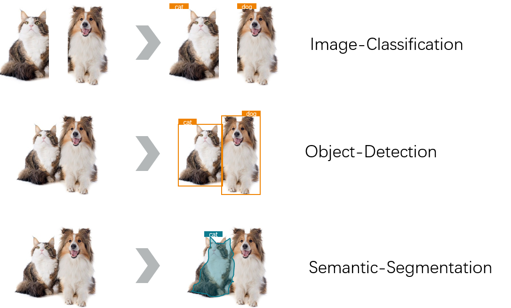

  

## Introduction

**ApulisVision** is a high-level computer vision toolbox based on PyTorch. It supports several major computer vision tasks, including  **Image Classification**, **Object Detection**, and **Semantic Segmantation**. ApulisVision is an open source project developed by [ApulisTech](https://github.com/apulis).

The master branch works with **PyTorch 1.3 to 1.5**. 

  

## Main Support
- [x] [Image Classification](/docs/Image-classification.md)
- [x] [Object Detection](/docs/Object-Detection.md)
- [x] [Semantic Segmentation](/docs/Semantic-Segmentation.md)

## License

This project is released under the [Apache 2.0 license](LICENSE).

## Installation

Please refer to [install.md](docs/install.md) for installation and dataset preparation.

## Getting Started

Please see [getting_started.md](docs/getting_started.md) for the basic usage of ApulisVision. There are also tutorials for [finetuning models](docs/tutorials/finetune.md), [adding new dataset](docs/tutorials/new_dataset.md), [designing data pipeline](docs/tutorials/data_pipeline.md), and [adding new modules](docs/tutorials/new_modules.md).

For trouble shooting, please refer to [trouble_shooting.md](docs/trouble_shooting.md)

## Contributing

We appreciate all contributions to improve ApulisVision. Please refer to [CONTRIBUTING.md](.github/CONTRIBUTING.md) for the contributing guideline.

## Acknowledgement

ApulisVision is an open source project that is contributed by researchers and engineers from various colleges and companies. We appreciate all the contributors who implement their methods or add new features, as well as users who give valuable feedbacks.
We wish that the toolbox and benchmark could serve the growing research community by providing a flexible toolkit to reimplement existing methods and develop their own new classifiers, detectors and segmentors.

## Contact

This repo is currently maintained by JianZheng Nie ([@jianzhnie](https://github.com/jianzhnie)).
